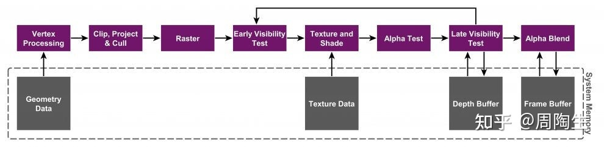
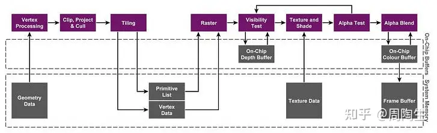
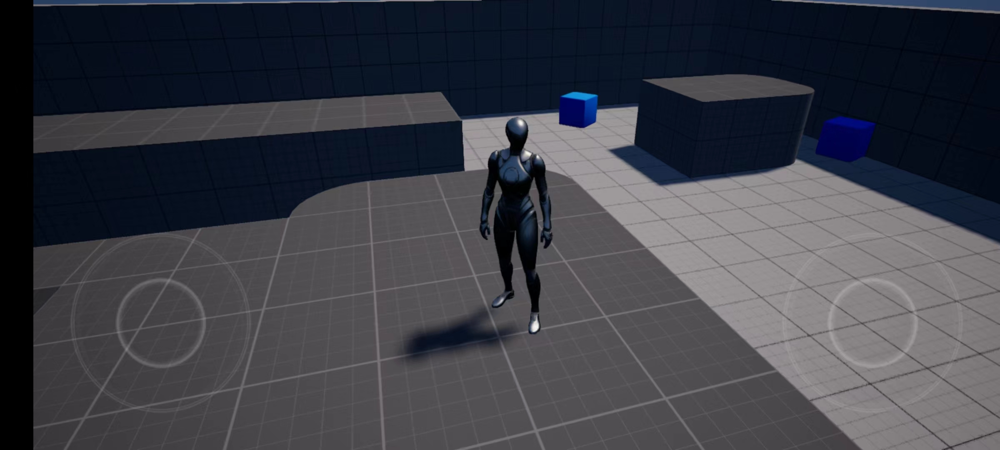
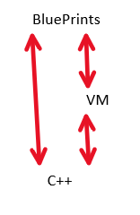

# 腾讯客户端开发公开课(一): UE入门

# 游戏引擎简介

——常见的游戏引擎有哪些？

——什么是游戏引擎？

## UE引擎


### 相关游戏

天堂2、黎明觉醒、和平精英、堡垒之夜

### 优势

1. 渲染品质高：电影级别的PBR渲染，先进的着色模型
2. 美术制作：资产制作管线成熟
3. C++\蓝图：性能与可视化编程并重，也支持Lua脚本
4. 开发周期：UE引擎本身是基于射击类游戏的GamePlay框架，非常适合快速开发这类游戏
5. 跨平台：支持移动、主机、PC、VR、Switch，开发后可以release到不同的平台
6. 开源：阅读源码有利于技术提升、定制化改造

## Unity3D


### 相关游戏

英雄联盟手游、全民斗战神、最强NBA、QQ华夏

## CryEngine V


### 相关游戏

Far Cry（孤岛惊魂）系列、Far Crysis（孤岛危机）系列、御龙在天、战争前线、TheClimb（VR游戏）

### 特点

最初是[Crytek](https://zh.wikipedia.org/wiki/Crytek)为[NVIDIA](https://zh.wikipedia.org/wiki/NVIDIA)开发的技术演示，后来该公司看到了它的潜力，将其用于[FPS游戏](https://zh.wikipedia.org/wiki/%E7%AC%AC%E4%B8%80%E4%BA%BA%E7%A7%B0%E5%B0%84%E5%87%BB%E6%B8%B8%E6%88%8F)《[孤岛惊魂](https://zh.wikipedia.org/wiki/%E5%AD%A4%E5%B2%9B%E6%83%8A%E9%AD%82_(%E6%B8%B8%E6%88%8F))》的开发。

Wiki：

[CryENGINE - 维基百科，自由的百科全书](https://zh.wikipedia.org/zh-sg/CryENGINE)

## Open3D Engine


### 特点

**Open 3D Engine**是一个自由及开放的3D游戏引擎，由[Linux基金会](https://zh.wikipedia.org/wiki/Linux%E5%9F%BA%E9%87%91%E6%9C%83)旗下的开放3D基金会开发。该引擎的初始版本基于[Amazon Games](https://zh.wikipedia.org/w/index.php?title=Amazon_Games&action=edit&redlink=1)提供的[Amazon Lumberyard](https://zh.wikipedia.org/wiki/Amazon_Lumberyard)（Amazon Lumberyard基于[Crytek](https://zh.wikipedia.org/wiki/Crytek)的[CryEngine](https://zh.wikipedia.org/wiki/CryEngine)）的更新版本

官网：

[Home - O3DE](https://o3de.org/)

[从 Lumberyard 到 Open3D — Amazon游戏引擎101](https://zhuanlan.zhihu.com/p/420063218)

## Source2


### 介绍

1996年Id Software发布Quake，在这之后把游戏中的引擎部分提炼出来，由Valve重构为GoldSrc引擎，渐渐优化后诞生了Source引擎，这个引擎2004年随半条命发布。之后2015年的Dota2和TheLAB都是Source2引擎，2019年的刀塔霸业手游和2023年的CS go 2也是Source2引擎。

## 寒霜引擎 Frostbite Engine


### 介绍

EA的引擎，战地、星球大战、FIFA、植物大战僵尸、极品飞车的一些版本用的都是不同版本的寒霜引擎。

## 其他内部引擎

### 顽皮狗 神秘海域 最后生还者

### R星 GTA 大表哥系列

### 育碧 刺客信条  幽灵行动

### 动视  Infinity Ward的IW引擎基于Id Tech3 与起源引擎同源  使命召唤

# 游戏引擎架构

## 绪论

### 概念

***游戏引擎：专门为游戏而设计的工具及科技集合***

引擎是数据驱动且可重用的，完全不包含GamePlay的工具

在开发多款游戏的过程中，那些公共的部分会被抽取出来形成游戏引擎

### 特点

- 通用性与偏向性
- 可扩展性：开发不同游戏需要定制内容
- 完善工具链：游戏开发需要美术资产管理和性能评估工具等小的工具链

### 推荐书：游戏引擎架构

## 游戏引擎世界编辑器的两种设计

1. 世界编辑器与游戏引擎分开，地图编辑好后导出再给到游戏引擎去使用（很多老牌引擎这样做）
2. 世界编辑器放在游戏子系统上，所见即所得，运行过程中可以修改游戏场景，改完之后就是最终想要的，修改会序列化到地图文件里面去（UE）

## 游戏引擎：渲染

引擎开发会涉及的比较多

[Tile Base Render (Forward+)](https://zhuanlan.zhihu.com/p/553907076)

### Differed Renderer(延迟渲染)

- 编辑器、PC、Console默认渲染管线
- Feature levels “SM4”, ”SM5”
- 主要用于解决多光源问题
- More…

[LearnOpenGL - Deferred Shading](https://learnopengl.com/Advanced-Lighting/Deferred-Shading)

[Deferred shading](https://en.wikipedia.org/wiki/Deferred_shading)

### Forward+ Renderer

- 用于桌面VR，支持MSAA
- Feature Level “SM5”
- 来自论文《****Forward+: Bringing Deferred Lighting to the Next Level****》
- 这一方法会对光源进行剔除，对于每个像素，只有对其着色有影响的光源才会参与计算。Forward+是对传统前向渲染的一个改进。这一方法利用了GPU的并行计算能力进行光源剔除，将最终对像素有影响的光源列表传递给最终的渲染着色器。尽管Forward+增加了最终的渲染着色器的压力，但相比于基于计算着色器的延迟光照方法，它需要进行的内存传输操作更少。

[Forward+ Shading](https://zhuanlan.zhihu.com/p/85615283)

### Mobile Renderer

- Forward Render， Deferred Render
- Feature levels “ES2”, “ES3_1”, “Vulkan”
- 虚幻引擎移动端渲染模式

### 推荐书：Real Time Rendering

### 推荐课程：GAMES101 GAMES202

### IMR: Immediate Mode Rendering

立即渲染模型

三角形数据正常渲染，经过定点处理、裁剪、参数缓存、早期可见性测试、纹理着色、透明度测试、可见性测试（深度测试）、透明混合



用于PC桌面游戏，GPU与主存有大量交互，带宽要求很高，能耗很高。

### TBR: Tile Based Rendering

把屏幕分为一小块一小块的格子，例如32x32的像素等等

数据量较小，避免了带宽和功耗的问题，可以在GPU片上处理，不用经过主存。



### TBDR: Tile Based Defered Rendering

Defered主要指光栅化之后HSR，把看不到的东西提前Remove掉，免得进行不必要的计算


## 游戏引擎：物理

### Havok引擎

先后被Intel和微软收购的商业闭源引擎

塞尔达即使用了Havok引擎

### PhysX

Nvidia的引擎

集成于UE4和Unity

没有64位扩展，大地图不够用，UE5弃用

### Bulet

最早开源

用于GTA5和荒野大镖客

### Chaos

UE开发的引擎  

实时电影视觉效果级别的大范围破坏

### 物理引擎主要解决的是碰撞检测、动态约束、刚体物理、车辆物理、布娃娃系统等

# UE引擎介绍

——UE引擎是什么样子的？

——学习UE该怎么入手？

## UE引擎进化史

***使用UE引擎开发射击游戏会得心应手***

- 1998 UE1 制作FPS 《Unreal》 支持MOD
- 2003 UE2 制作FPS 《Unreal Tournament 2003》 支持粒子系统、Static Mesh静态网格体工具用于构建场景、物理引擎、Matinee动画编辑器
- 2006 UE3 制作TPS 战争机器《Gears of War》使用DirectX9渲染引擎 支持可视化脚本、新的物理引擎、改进了灯光和材质
- 2016 UE4 TPS 《Gears of War 4》使用DirectX11渲染引擎，基于物理的渲染 支持蓝图脚本，对管线进行了改进，可以制作开放世界
- 2021 UE5 制作TPS《堡垒之夜》

### 特点：游戏和引擎是同步制作的，提供了很多FPS和TPS游戏开发会遇到的功能

UE5发布（视频仔细了解下）像素级别渲染技术NANITE  环境光照LUMEN NIAGARA

### UE学习资料

1. Youtube UE
2. 知乎 UE
3. Bilibili UE
4. Epic 学习

# UE安装

看UE官网文档即可：

[Download Unreal Engine](https://www.unrealengine.com/zh-CN/download)

# UE编辑器使用（本节仅供参考，比较零碎）

UE不仅仅是一个世界编辑器，还管理整个游戏资产数据，并提供统一、实时、所见即所得的资产数据库视图

建议直接实践去熟悉整个编辑器~

[虚幻引擎 UE5 快捷键 一览](https://zhuanlan.zhihu.com/p/608377739)

### 创建项目

从左到右点击GAMES-Blank（空项目）-C++（target platform选择安卓）

这里start content会包含一些东西，注意项目名字用英文

### 地图关卡的创建和分层

UE4左上角File-NewLevel

UE5有大世界地图 

UE的level分为

persistent level：默认地图（第一关）

streaming level：需要加载的关卡（其他关卡）

### 可视化游戏世界

游戏视口有不同的视角，左上角的Perspective可以进行调整，查看顶视图、观察光照效果（光照模式（Lit）、非光照模式（Unlit）、线框模式（Wireframe））、

## 导航

WASD控制方向，QE升高降低 

viewport的小相机可以调整在场景中的移动速度 

F聚焦物体也是常用的

快捷键

1. Ctrl+数字可以快速切换到书签视角
2. G可以看到游戏最终效果

## 选取

在场景中选取一个Actor

左上角show-隐藏掉不想要的

或 根据level调整整个level的可见性

## World Outlier

搜索：可以使用关键字、+是代表完全匹配，-代表排除

5的小图标表示静态或运动的

顶视图也可以框选，如下在顶视图框选

perspective时区域框选要按住ctrl+alt

## 属性设置

WER按快捷键 ,移动时对齐的最小刻度也是可以选择的

右上角有世界坐标与局部坐标的切换

模型拖到游戏世界时，按End可以中心贴地，Alt+End则是轴心贴地，Shift+End是碰撞盒贴地

## 快速迭代

## 碰撞盒 Volume

## Content Broswer

Content目录下文件结构类似Unity的Asset文件夹，ue4资源是.uasset文件，非ue4资源建议单独目录存放

## 资源迁移

reference view可以查看资源之间的引用关系

商城资产要导入自己的游戏就选中资源点击Migrate进行资源迁移 

使用资源迁移工具来保证内部资源之间的相互引用关系不丢失 资源必须在Content目录下

## DDC Derived Data Cache

[Derived Data Cache](https://docs.unrealengine.com/5.2/en-US/derived-data-cache/)

UE数据处理的特色，例如相同的资源PC平台和移动平台可能贴图格式不一样，UE会整理一下放在临时文件夹，打包时直接用，避免了平台的相互交叉

## 命名规范

[](https://github.com/skylens-inc/ue4-style-guide/blob/master/README.md)

# UE源码构建

## 加入组织

[开始入门](https://docs.unrealengine.com/5.3/zh-CN/getting-started-and-setup-for-android-projects-in-unreal-engine/)

[GitHub上的虚幻引擎](https://www.unrealengine.com/zh-CN/ue-on-github)

1. 注册UE官方账号
2. GitHub账户绑定EpicGame账号


1. 在Github对应的邮箱里点击加入UnrealEngine的组织

## 配置C++开发环境

[开发设置](https://docs.unrealengine.com/5.2/zh-CN/setting-up-your-development-environment-for-cplusplus-in-unreal-engine/)

## 编译项目源码

1. 在文件夹下右键启动git bash
2. git clone -b 分支名 --depth=1 仓库路径

***注：不使用- -depth会因为文件过大报错fetch-pack: invalid index-pack output***

1. 在下载目录运行setup.bat下载依赖文件
2. 运行GenerateProjectFiles.bat生成工程文件


1. 右键用VisualStudio打开.sln文件
2. 生成项目（注意可以提前设置大一点虚拟内存↓），时间略长

[编译UE4时error C3859: 超过了 PCH 的虚拟内存范围问题解决](https://zhuanlan.zhihu.com/p/109178480)


1. 在编译目录下的\Engine\Binaries\Win64找到UnrealEditor.exe(UE5编译生成的是UnrealEditor.exe, UE4编译生成的是UnrealEditor4.exe)

***注意：UE编译不是传统VS编译，是使用UBT（Unreal Build Tool）完成的***

1. 调用Unreal Header Tools（UHT）预处理头文件，解析头文件中引擎相关类元数据，产生胶水代码
2. 调用特定平台普通C++编译器，正式开始编译 

# Android打包

1. 根据官网设置Android（强烈建议以下两个教程搭配使用）

[设置Android SDK和NDK](https://docs.unrealengine.com/5.2/zh-CN/how-to-set-up-android-sdk-and-ndk-for-your-unreal-engine-development-environment/)

[UE部署到Android以及杂症的解决](https://zhuanlan.zhihu.com/p/610569845)

***注意：1. 在Android Studio里安装Android SDK Command-line Tools时要点击右下角勾选Show Package Details以选择相应版本，默认会下载最新版。***

1. ***注意查看手机安卓版本对应的API Level，在SetUpAndroid.bat中设置成对应的版本***

[SDK 平台版本说明  |  Android 开发者  |  Android Developers](https://developer.android.com/studio/releases/platforms?hl=zh-cn)

1. 打开UE创建Android项目
    
    [Android快速入门](https://docs.unrealengine.com/5.2/zh-CN/setting-up-unreal-engine-projects-for-android-development/)
    
2. 在PC预览


1. 打包
    
    [打包Android项目](https://docs.unrealengine.com/5.2/zh-CN/packaging-android-projects-in-unreal-engine/)
    

***（注意：比较耗时，可以不试）也可以直接在手机上直接运行（手机连接电脑后直接play）***


初次打包时间较久，后面重新打包在一分半左右。


1. 成果



其他问题：

1. Intel HAXM安装失败-打开log显示系统不支持：


解决：在下面链接的方法4修复

[Android Studio中 HAXM安装失败的问题(Intel HAXM installation failed. To install Intel HAXM follow the...)_intel庐 haxm installation failed. to install intel庐_恒元纪的博客-CSDN博客](https://blog.csdn.net/qq_24033983/article/details/123335806)

1. 不能通过bat安装apk


解决：看下是否没有打开手机的“通过USB安装”


# UE编程技巧

——开发新游戏从0开始吗？

——开发UE用什么语言？

## 游戏框架

### GameMode

设置游戏规则，包括如何加入游戏，是否可暂停，关卡过渡，以及其他游戏行为（如获胜条件等）。

只存在于服务器或者单机游戏

### GameState

表示整个游戏的状态，包含需要复制到客户端的信息，通常含有分数，比赛是否已开始等。

### PlayerState

指玩家的状态，非玩家AI不会有玩家状态，包括玩家姓名或得分、等级、HP等。

### Pawn

是Actor的一个子类，充当游戏中的生命体。

### Character

是Pawn Actor的子类，用作玩家角色。

包括碰撞设置、双足运动的输入绑定、以及由玩家控制的运动附件代码。

### Controller

用来处理Pawn

### PlayerController

代表一个真实玩家，获取游戏输入并转换成交互。

### AIComtroller

计算AI角色的行为

## 蓝图



是一种特殊的资产，编译后产生对应字节码，运行时由蓝图虚拟机解释执行

### 分类：

- Level Blueprint
- Blueprint Class
- Data-Only Blueprint
- Blueprint Interface
- Blueprint Macros

### Level Blueprint

自动创建，每个Level一个，生命周期与Level一致，监听Level级的事件。

### Blueprint Class

自己添加，需要继承已有的类，通过添加不同组件来丰富功能，通常放在关卡里执行自身的逻辑功能。

### 使用蓝图

从监听的事件开始

从其他Actor接口调用

调用蓝图库中的函数

### Event

- BeginOverlap
- EndOverlap
- Hit
- BeginPlay
- EndPlay
- Destoryed
- Tick
- Custom

### Function

### Variables

### 蓝图和C++之间的成员变量

标签：UPROPERTY()

### 蓝图和C++之间的函数调用

Tag: UFUNCTION(BlueprintCallable/BlueprintlmplementableEvent/BlueprintNativeEvent)

lsValid (return true if the object is usable :non-null and not pending kill)

- 使用编辑器创建蓝图类，将不同功能组件结合起来
- 蓝图类继承C++类，由程序暴露可视化变量、函数和事件

### 蓝图的缺点

- 容易形成蜘蛛网
- 二进制格式，Diff和Merge不方便

### 使用原则

- 用于数值配置
- 简单的效果展示
- 特别简单的逻辑（代码不超过屏幕范围）

## Lua

目前最主流的游戏脚本语言，有利于热更新

书目《Lua程序设计（第二版）》

### 插件

slua-unreal

Unlua

- Unreal引擎的插件
- 通过unreal反射能力，导出蓝图接口和静态C++接口给lua
- 支持lua到C++双向，lua到蓝图双向调用

## C++ in UE

### 编码规范

T-模板类的前缀,i.e.TArray, TMap,TQueue

U-继承自 UObject 的类前缀,i.e.UTexture

A-继承自AActor 的类前缀,i.e.AGameMode

F-structs及其他多数类均以F为前缀,i.e.FName,FVector

I-抽象接口类前缀,i.e.ITransaction

E-枚举类型的前缀。,i.e.ESelectionMode

b-布尔变量必须以b为前缀i.e.bEnabled

### 基本类型

不使用C++原生的整型(char, short, int, long,etc.)

自定义ints & strings in GenericPlatform.h (int32, uint32, uint64, TCHAR, ANSICHAR etc.)

### 容器

TArray, TSparseArray - Dynamic arrays

TLinkedList,TDoubleLinkedList

TMap - Key-value hash table

TQueue - Lock free FIFO

TSet - Unordered set (without duplicates)

And many more in Core module

### 智能指针

TSharedPtr, TSharedRef - for regular C++ objects

TWeakPtr - for regular C++ objects

TWeakObjPtr - for UObjects

TAutoPtr, TScopedPtr

TUniquePtr

### 其他常用结构体

FBox, FColor, FGuid, FVariant, FVector, TBiglnt, TRange

## UObject

### UObjects 增加了标准C++ 的很多功能

Run-time reflection of class properties and functions

Serialization from/to disk and over the network

Garbage collection

Meta data

Also: Blueprint integration

## Magic Macros

UCLASS -类

USTRUCT - 结构体

UFUNCTION -成员函数

UPROPERTY - 成员变量

UObject中包含了一个重要的函数GetWorld()，可以方便获取需要重要信息

### 示例

```cpp
USTRUCT()
struct FVector2D
{
	UPROPERTY()
    float x;
    
    UPROPERTY()
    float y;
    
    UPROPERTY()
    float GetLength() const;
};
```

可以在配置文件中确定好成员的初始值

## 局部优化关闭

Development模式会去掉很多调试信息，可以通过单个cpp或单个函数关闭优化

关闭优化：

```cpp
#ifdef __clang__
#pragma clang optimize off
#else
#pragma optimize("", off)
#endif
```

开启优化：

```cpp
#ifdef __clang__
#pragma clang optimize on
#else
#pragma optimize("", on)
#endif
```

也可以在*.build.cs中按模块关闭优化

OptimizeCode = CodeOptimization.Never;

# 引擎工具

### 日志

```cpp
UE_LOG(LogGameSettings, Log, TEXT("[Render] set shadow : [%d]"), bShadow);

DECLARE_LOG_CATEGORY_EXTERN(LogGameSettings, Log, All);

DEFINE_LOG_CATEGORY(LogGameSettings);
```

### 可视化日志

VisualLogger工具是UE4提供的可视化记录工具。

通过在逻辑代码中通过日志形式收集信息，然后用工具进行绘制显示来进行回放，同时收集到的信息可以序列化为磁盘文件。

### 内置控制台

- Stat FPS
- Stat UNIT
- Stat Game
- Stat SceneRendering
- Stat ENgine
- Stat InitViews
- Stat RHI
- Stat startfile, stat stopfile

性能分析文件保存路径：{Project}/Saved/Profilling/UnrealStats

打开分析文件：Window->Developer Tools->Session FrontEnd->Profiler->Load

### 调试相机

输入命令freezerendering可以冻结当前帧的渲染

输入命令toggledebugcamera可以自由移动相机

show bounds可以显示没有被culling掉的物体的包围盒

### 运行模式

- game

Q:以游戏模式启动和调试 从工程文件中右键选择Launch game可以启动游戏

启动游戏实际上是在启动编辑器时加个-game参数

在Debug启动项中加入-game参数，可以调试游戏

### GPU Profile

Ctrl + Shift +,在编辑器模式下截取GPU快照，并可视化显示

[RenderDoc](https://renderdoc.org/)

RenderDoc是一个独立图形调试工具，已经内置于UE4，可以对游戏进行单帧捕获和详细分析。

Unreal Insight

# 他山之石

[UE源码下载编译+安卓打包配置及部分补充杂症的解决](https://zhuanlan.zhihu.com/p/655580241)

[UE4学习笔记（1）：UE源码下载编译+安卓打包](https://zhuanlan.zhihu.com/p/655375421)

[UE部署到Android以及杂症的解决](https://zhuanlan.zhihu.com/p/610569845)