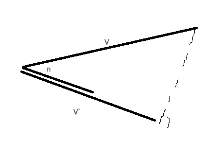

# 腾讯游戏开发公开课(三): C++代码规范与游戏3D数学

# 代码规范的必要性

- 代码的长期维护
- 团队合作效率
- 便于搜索

# 命名

- 不写缩写
- 采用下划线或驼峰

# 格式

- 缩进
- 代码块间的空行

# 代码书写

- 直白易懂
- 关键逻辑添加注释（便于持续迭代作品）

# UE4的C++代码规范

[代码规范](https://docs.unrealengine.com/4.26/zh-CN/ProductionPipelines/DevelopmentSetup/CodingStandard/)

## 命名

- 清晰明确避免过度缩写
- 变量名采用大驼峰式：CamelCase，bool类型必须加b作为前缀
- 类型名：前缀+大驼峰（U,A,S这三个必须要加）
- 引用传入可能修改的函数变量：加Out前缀

## 数据类型

- 基础类型：uint64/uint16等
- 字符串类：使用UE定义的FString、FText、FName、TCHAR
- 容器类：使用UE定义的TArray、TMap

## 代码风格

- 大括号换行
- if-else对齐
- 使用Tab缩进
- switch-case必须要有default，如果fall-through，必须有明确注释，（fall through意味着case中没有break语句，容易出bug）

[fall through switch的用法_fallthrough switch-CSDN博客](https://blog.csdn.net/huangjiayun1226/article/details/6016093)

## 命名空间

- UnrealHeaderTool仅仅支持全局命名空间的类型

- 不要再全局命名空间使用using声明
- 一些宏在命名空间内可能会失效，尝试UE_前缀的版本

## C++11

- 使用nullptr而不是NULL来表示空指针
- Lambda函数必须明确指出返回类型
- 不要使用auto，除了：lambda函数，迭代器声明、模板中类型推导

# 如何写出符合规范的代码

- 理解为什么要设立这个代码规范
- 熟悉代码规范
- 使用辅助工具标注出不符合规范的代码
    - Cpplint，Resharper C++等

# 游戏当中的3D数学

- 向量
- 内积
    - 重点：
        - 内积可以用来求投影：向量与某方向单位向量点乘即得到在该方向上的投影模长
        
        
        
        - 内积可以用来求反射：
        
        
        
- 外积
    - 重点：
        - 可以用来求法向量
- 基底及坐标

# 线性变换及对应矩阵

## 基底变换

新的基底由原本的基底经过线性变换得到，那么这个线性变换组成的系数矩阵就是过度矩阵

**一个经过线性变换的向量在新旧基底中的坐标是不变的**

所以，想要得到不同坐标系下的新坐标，只需要找到过渡矩阵即可，过渡矩阵通俗意义理解就是坐标系是发生了什么样的变化：例如blender-》three.js的坐标系变换就是：blender的Y轴在three.js里面是z轴，blender的x轴变成了y轴，z轴变成了x轴，所以过度矩阵就是：

然后将blender的坐标乘上这个过度矩阵就可以得到three.js里面的坐标了

# 旋转变换及其表述

## 二维情况旋转（适合手推一遍）

## 三维空间中绕坐标轴旋转

- Z轴：利用二维旋转的推导思想，绕Z轴旋转相当于在XOY平面沿着原点旋转
- X轴：在YOZ平面沿原点旋转
- Y轴：在XOZ平面沿远点旋转

## 欧拉角

- 一个旋转可以拆分成分别绕三个轴的旋转矩阵的乘积（可以理解为三个轴的旋转矩阵是基底）
- 三个矩阵乘法顺序不同，表达的旋转也不同

### 引擎的区别

- Unity中的坐标是列向量，矩阵是左乘
- UE中的坐标是行向量，矩阵是右乘

注意：UE和Unity中的坐标轴含义不同，yaw偏航角在Unity对应绕Y轴，在UE对应绕Z轴，也就是说，在Unity中是Y向上，而UE中是Z向上，也正是因此差异，pitch俯仰角和roll翻滚角对应的绕轴也不一样

### 万向节锁

**当一个欧拉角包含绕Y轴旋转90度时，绕X轴和绕Z轴旋转已经是在绕同一个轴在进行旋转，这个时候只有两个轴在起作用。这个时候就是万向锁的状态。**

很好理解，因为欧拉角都是沿局部坐标系旋转，y转90度的时候，局部坐标系中的X和世界坐标系的z（也是旋转前的局部坐标系的Z）重合了，所以会出现一顿折腾相当于原本绕z轴的一个旋转。

## 三维空间绕任意轴的旋转

如下图所示向量V绕单位向量n旋转θ度，定义为，V在与n向量垂直的平面上的投影绕n旋转θ度后与向量V的原点连接得到的V`

得到V绕n旋转θ角的旋转矩阵

## 旋转矩阵

重点是**旋转矩阵的逆就是旋转矩阵的转置**

一个3X3矩阵不一定是旋转矩阵，因为可能会出现多余的数据

旋转矩阵相对于四元数和欧拉角，存储空间要求大，而且不能插值 

## 单位四元数

# 齐次坐标系下的矩阵变换

## 仿射变换

## 坐标变换

局部坐标-》世界坐标-》相机坐标-》裁剪坐标-》NDC→屏幕坐标

## 绕不经过原点的轴的旋转

## 投影变换

## 归一化到NDC坐标

# QA

1. 游戏中哪些地方适合蓝图，哪些地方适合C++？
    1. 性能要求高的适合C++，其他都可以用蓝图
2. 四元数和欧拉角怎么转换？

[三维旋转：欧拉角、四元数、旋转矩阵、轴角之间的转换](https://zhuanlan.zhihu.com/p/45404840)

1. 因为矩阵不能插值，所以欧拉角和四元数用的多？
    1. 对，同时还节省空间